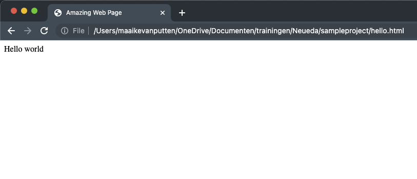

# This is my portfolio

This file is going to show how you did during this track.

More info on markdown can be found [online](https://en.wikipedia.org/wiki/Markdown).

---

## Week 1

### Exercise 1

Describe your thought process. Explain your solutions briefly. Make sure to show images of all the things you've done.

The code:

```
<html lang="en">
    <head>
        <title>Amazing Web Page</title>
    </head>
    <body>
        <p>Hello world</p>
    </body>
</html>
```

A screenshot of the result:


The complete solution can be found [here](hello.html).

### Exercise 2

Describe your thought process. Explain your solutions briefly. Make sure to show images of all the things you've done.

The code:

```
<html lang="en">
    <head>
        <title>Amazing Web Page</title>
    </head>
    <body>
        <p>Hello world</p>
    </body>
</html>
```

A screenshot of the result:


### Assessment score (optional)

I got **_95%_**

### Project

For this project we:

- worked hard
- worked smart
- had a lot of fun

Include implementation decisions. Explain pieces of your code.

Include screenshot of all the results as well:


---

## Week 2

### Exercise 1

Describe your thought process. Explain your solutions briefly. Make sure to show images of all the things you've done.

The code:

```
<html lang="en">
    <head>
        <title>Amazing Web Page</title>
    </head>
    <body>
        <p>Hello world</p>
    </body>
</html>
```

A screenshot of the result:


### Exercise 2

Describe your thought process. Explain your solutions briefly. Make sure to show images of all the things you've done.

The code:

```
<html lang="en">
    <head>
        <title>Amazing Web Page</title>
    </head>
    <body>
        <p>Hello world</p>
    </body>
</html>
```

A screenshot of the result:


### Assessment score (optional)

I got **_95%_**

### Project

For this project we:

- worked hard
- worked smart
- had a lot of fun

Include implementation decisions. Explain pieces of your code.

Include screenshot of all the results as well:


---
